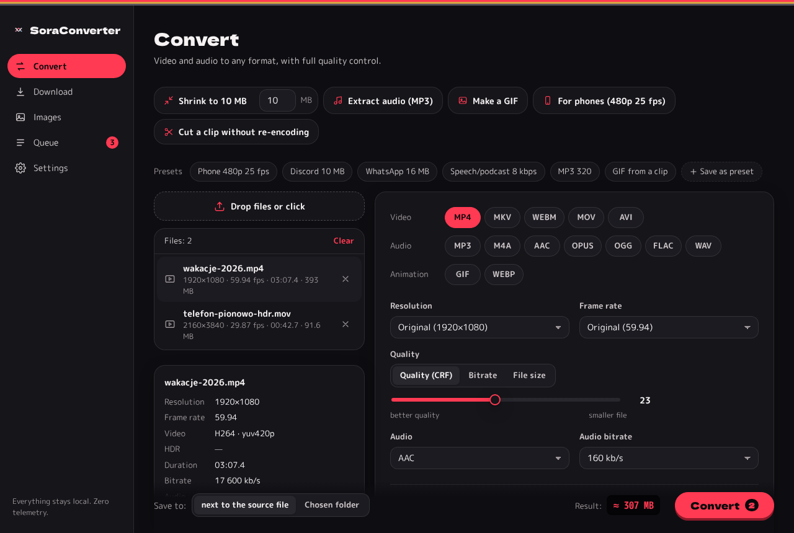

# SoraFlux

**A free, open-source, local video, audio, image and GIF converter with downloads (yt-dlp) and a simple GUI.**
Everything runs on your computer: no uploads, no limits, no ads, no telemetry.

[Polska wersja → README.md](README.md)



## Features

- **Downloads** (yt-dlp): most popular video and music sites plus direct links; quick actions "Audio only MP3" and "Best quality", subtitles, thumbnail, metadata, chapters, playlists, "convert after download". The app watches yt-dlp's age: an old system copy (e.g. from pip) is replaced by the app's own current copy, and "Update yt-dlp" only ever updates that copy.
- **Themes**: Kissaten, City Pop and MiniDisc in a cybersora or Japanese palette, each light and dark (WCAG AA contrast), plus your own themes with an editor, export and import. Bundled fonts, works offline.
- **One-click quick actions**: "Shrink to X MB", "Extract audio (MP3)", "Make a GIF", "For phones (480p 25 fps)", "Cut a clip without re-encoding" (seconds instead of minutes, no quality loss). Fine-tune everything afterwards in the panel.
- **Before/after preview**: one frame of the result with exactly your settings, at a moment picked with a slider, compared with a split slider. For audio: play 5 s of the result (hear what AAC at 8 kbps really sounds like).
- **Full video quality control**: resolution (2160p…144p or custom W×H), frame rate (keep, 60/50/30/25/24/15/10, custom), CRF slider, bitrate in kbps or a **target size in MB** (2-pass plus automatic correction so the file really fits).
- **Audio**: AAC, MP3, Opus, Vorbis, FLAC, WAV/PCM, copy, none; **8–320 kbps**, 8–96 kHz, mono/stereo, loudness normalization, track choice (or all tracks) when a file has several.
- **Any container**: mp4, mkv, webm, mov, avi, gif, mp3, m4a, aac, opus, ogg, flac, wav. Incompatible codecs are ruled out; subtitles are carried over where possible (MP4: mov_text, MKV: copy, WebM: WebVTT).
- **Proper GIFs**: two-pass palette, selectable dithering, fps, width, loop, trim, size estimate with a warning. Animated WebP as a lighter alternative.
- **Images**: PNG, JPG, WebP, AVIF, GIF, BMP, ICO; W×H or %, keep aspect / stretch / bars / crop, don't upscale, quality, batches.
- **Folder batches**: drop a folder → every matching file, keeping the subfolder structure, with an extension filter and skipping files already converted.
- **Explorer context menu** "Convert with SoraFlux"; more files go to the window that is already open.
- **File info card**: resolution, rotation, frame rate (incl. variable), codecs, bit depth, HDR, audio tracks, subtitles.
- **When done**: system notification, "show in folder", size comparison ("412 MB → 74 MB (−82%)").
- **Hardened** against common pitfalls: odd dimensions, 10-bit and **phone HDR** (automatic SDR conversion so colors don't wash out), variable frame rate, rotation metadata, paths with non-ASCII characters and longer than 260 characters, several 2-pass jobs at once, hardware encoders that fail (falls back to software), closing the app mid-job (no ffmpeg left running). Details: [PANCERZ.md](PANCERZ.md) (Polish).
- Queue (1 video at a time by default, images alongside, "Keep the computer responsive"), live size estimate, ffmpeg command preview, presets and your own presets, Polish and English, dark and light theme (WCAG AA contrast), keyboard navigation, portable mode.

## Screenshots

All screenshots (6 themes × light/dark and every tab) live in [`zrzuty/`](zrzuty/). See the [Polish README](README.md#zrzuty-ekranu) for a gallery.

## How to use

1. **First run**: the wizard checks for ffmpeg and ffprobe. Download what's missing with one click (Windows: the officially recommended gyan.dev build, SHA256 verified) or pick the files yourself.
2. **Convert**: drop files or a folder (or click the drop zone, press Ctrl+O, or use "Convert with SoraFlux" in Explorer). Click a quick action or choose format, resolution, frame rate and quality; everything else is under "Advanced". Click a file in the list to see its info card; "Before / after preview" shows the result before you start.
3. **Download**: paste a link (or several), "Check", pick a quality or a quick action, "Download". Only download what you have the rights to; SoraFlux does not circumvent DRM.
4. **Images**: drop images, choose a format and size (W×H or %), quality.
5. **Queue**: progress, ETA, cancel, "Show in folder", size comparison.

Output goes next to the source (or to a folder you choose) and **never overwrites the original**: a name clash produces `name (1).mp4`. While working the file is called `name.part.mp4` and gets its final name only on success; partial files from a crash are cleaned up on the next start.

## Common problems

| Problem | What to do |
|---|---|
| Download: "The site blocked the download" (403) | Click "Update yt-dlp" on the Download tab and try again. Sites change often and a yt-dlp older than ~30 days stops working. The app uses its own yt-dlp copy, not the one from pip. |
| "ffmpeg missing" | Settings → Tools → "Download" (Windows) or `sudo apt install ffmpeg` / `brew install ffmpeg`, then "Detect again". You can also pick `ffmpeg.exe` manually. |
| Windows: "Windows protected your PC" | The installer isn't signed yet: "More info" → "Run anyway". Compare the SHA256 with `SHA256SUMS.txt` from the release. Signing: [docs/PODPIS.md](docs/PODPIS.md). |
| Washed-out colors after converting iPhone/Android videos | Those are HDR recordings. The app converts them to SDR when ffmpeg has the `zscale` filter (the gyan.dev build does). Without it you'll see a hint: download ffmpeg from Settings. |
| Video won't play on a phone / in WhatsApp | Use "For phones (480p 25 fps)" or MP4 + H.264 + AAC. Don't enable 10-bit and don't put Opus in MP4. |
| "Target size too small" | At this length the video gets < 50 kbps. Trim it, lower the resolution or raise the MB limit. |
| Output is bigger than the original | The source was already heavily compressed. Use bitrate or target MB instead of CRF, or a lower resolution. |
| A cut without re-encoding starts a bit early | That's how stream copy works: it starts on the nearest keyframe. For frame accuracy, use a normal conversion with trimming. |
| NVENC/QSV/AMF doesn't work | Only encoders that passed a test encode are shown; if one fails mid-job, the app finishes on the CPU (noted in the queue). Update your GPU driver. |
| The computer stutters while converting | Settings → Work: "Videos at once" = 1 and "Keep the computer responsive". |
| Reporting a bug | Settings → "Copy report" (versions, system, recent errors, without your folder paths) and paste it into the issue. |

## Privacy

**Everything is local, zero telemetry.** Files never leave your computer and no statistics are sent. The app only goes online when you ask: downloading tools (ffmpeg, yt-dlp, Deno), downloading videos and their thumbnails, and "Check for updates" (GitHub Releases). Settings (including the theme), presets and the error log are files on this computer (or in the `portable` folder next to the program in portable mode).

## External tools

ffmpeg, ffprobe, yt-dlp and Deno are **not in the repository or the installer**. Search order: path set in Settings → the app's tools folder (`%APPDATA%\SoraConverter\narzedzia`, `portable\narzedzia` in portable mode, or `narzedzia\` next to the `.exe`) → `PATH`. Exception: a yt-dlp from `PATH` older than 30 days (typically pip) with no own copy → the app downloads its own copy and uses it. Links and checksums: [`src-tauri/src/narzedzia/zrodla.rs`](src-tauri/src/narzedzia/zrodla.rs). Licenses: [THIRD_PARTY.md](THIRD_PARTY.md).

## Building

Requirements: [Rust](https://rustup.rs) (stable), Node.js 20+, on Windows: Visual Studio Build Tools (C++). On Linux: `libwebkit2gtk-4.1-dev libgtk-3-dev librsvg2-dev libayatana-appindicator3-dev libsoup-3.0-dev`.

```bash
npm install
npm run tauri dev                      # development
npm run tauri build -- --bundles nsis  # Windows installer (src-tauri/target/release/bundle/nsis/)
```

Releases and signing run in GitHub Actions: [`.github/workflows/release.yml`](.github/workflows/release.yml), [docs/PODPIS.md](docs/PODPIS.md), [docs/AKTUALIZACJE.md](docs/AKTUALIZACJE.md).

## Tests

`npm run bramka` runs fmt, clippy, `cargo test` (argument builder, **integration tests with real ffmpeg** verified by ffprobe: 480p/25 fps/AAC 8 kbps, 853×481, HDR PQ → SDR BT.709, VFR → 25 fps, rotation metadata, Opus 8 kbps, MP3 320, GIF 480 px 15 fps, WebP 50%; queue: parallel 2-pass jobs, cancel without leftover processes or `.part` files, `zażółć 日本 film.mp4` in a path > 260, hardware encoder fallback; preview and audio preview; Tauri IPC contract), the build, vitest (logic, i18n, panel, WCAG contrast, release config) and Playwright screenshots, one at a time.

## License

MIT, see [LICENSE](LICENSE). External tools: [THIRD_PARTY.md](THIRD_PARTY.md).
