<p align="center"></p>
<h1 align="center">SoraFlux</h1>

<p align="center"><b>Convert and download video, audio, images and GIFs. On your computer, no uploads.</b><br>
Free and open source (MIT). No limits, no ads, no telemetry.</p>

<p align="center"><b>English</b> · <a href="README.pl.md">Polski</a></p>

<h3 align="center"><a href="https://github.com/cybersora9/soraflux/releases/latest">⬇ Download SoraFlux for Windows</a></h3>
<p align="center">Windows 10/11 (64-bit) · <a href="#installation">How to install, step by step</a></p>

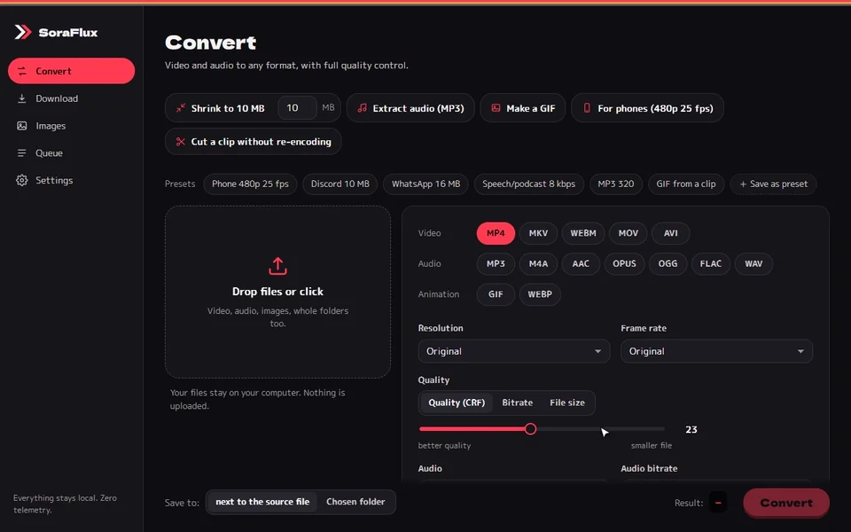

<sub>The demo was made with SoraFlux itself: screenshots of the app turned into an animated WebP by its own converter ([`scripts/showcase.mjs`](scripts/showcase.mjs)). Made-up files, real UI.</sub>

## Why SoraFlux

- **Simple mode for everyone.** Drop a file or paste a link, pick one of 3–4 ready-made actions ("To send: fits in an email", "Audio only (MP3)", "For the web"), press one button that says what will happen. No codecs, no numbers; Full mode is one click away.
- **No upload, no limits.** Your files never leave your computer. A 4 GB video works the same as a 4 MB one, as many as you like.
- **Full control over quality.** One-click actions ("Shrink to 10 MB", "For phones", "Make a GIF"), then resolution, frame rate, CRF, bitrate or an exact target size in MB, with a before/after preview.
- **6 themes, plus your own.** Kissaten, City Pop and MiniDisc in two palettes, light and dark (WCAG AA contrast), and an editor for your own themes.

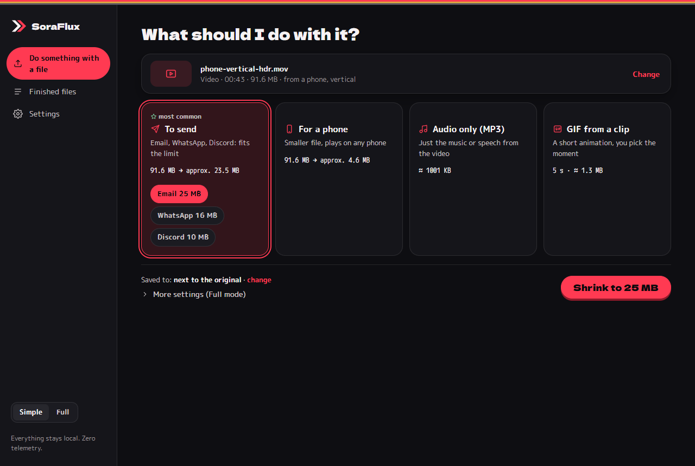

| | SoraFlux | A typical online converter |
|---|---|---|
| Uploading your files | none, everything is local | the whole file goes to someone else's server |
| File size limit | none | often 100 MB–1 GB, more for a fee |
| Ads | none | usually |
| Queue | many files and whole folders at once | one file at a time, waiting in line |
| Privacy | zero telemetry, no account | depends on the site |
| Works offline | yes (after the first tool download) | no |
| Quality settings | resolution, fps, CRF, bitrate, target MB, audio 8–320 kbps | a few presets |

## Features

- **Downloads** (yt-dlp): most popular video and music sites plus direct links; quick actions "Audio only MP3" and "Best quality", subtitles, thumbnail, metadata, chapters, playlists, "convert after download". The app watches yt-dlp's age: an old system copy (e.g. from pip) is replaced by the app's own current copy, and "Update yt-dlp" only ever updates that copy.
- **Themes**: Kissaten, City Pop and MiniDisc in a cybersora or Japanese palette, each light and dark (WCAG AA contrast), plus your own themes with an editor, export and import. Bundled fonts, works offline.
- **One-click quick actions**: "Shrink to X MB", "Extract audio (MP3)", "Make a GIF", "For phones (480p 25 fps)", "Cut a clip without re-encoding" (seconds instead of minutes, no quality loss). Fine-tune everything afterwards in the panel.
- **Before/after preview**: one frame of the result with exactly your settings, at a moment picked with a slider, compared with a split slider. For audio: play 5 s of the result (hear what AAC at 8 kbps really sounds like).
- **Full video quality control**: resolution (2160p…144p or custom W×H), frame rate (keep, 60/50/30/25/24/15/10, custom), CRF slider, bitrate in kbps or a **target size in MB** (2-pass plus automatic correction so the file really fits).
- **Audio**: AAC, MP3, Opus, Vorbis, FLAC, WAV/PCM, copy, none; **8–320 kbps**, 8–96 kHz, mono/stereo, loudness normalization, track choice (or all tracks) when a file has several.
- **Any container**: mp4, mkv, webm, mov, avi, gif, mp3, m4a, aac, opus, ogg, flac, wav. Incompatible codecs are ruled out automatically; subtitles are carried over where possible (MP4: mov_text, MKV: copy, WebM: WebVTT).
- **Proper GIFs**: two-pass palette, selectable dithering, fps, width, loop, trim, size estimate with a warning. Animated WebP as a lighter alternative.
- **Images**: PNG, JPG, WebP, AVIF, GIF, BMP, ICO; W×H or %, keep aspect / stretch / bars / crop, don't upscale, quality, batches.
- **Folder batches**: drop a folder → every matching file, keeping the subfolder structure, with an extension filter and skipping files already converted.
- **Explorer context menu** "Convert with SoraFlux"; more files go to the window that is already open.
- **File info card**: resolution, rotation, frame rate (incl. variable), codecs, bit depth, HDR, audio tracks, subtitles.
- **When done**: system notification, "Show in folder", size comparison ("412 MB → 74 MB (−82%)").
- **Hardened** against common pitfalls: odd dimensions, 10-bit and **phone HDR** (automatic SDR conversion so colors don't wash out), variable frame rate, rotation metadata, paths with non-ASCII characters and longer than 260 characters, several 2-pass jobs at once, hardware encoders that fail (falls back to software), closing the app mid-job (no ffmpeg left running). Details: [HARDENING.md](HARDENING.md).
- Queue (1 video at a time by default with images alongside, "Keep the computer responsive", a warning when the source file is truncated), live size estimate, ffmpeg command preview, built-in and your own presets, Polish and English, dark and light theme (WCAG AA contrast), keyboard navigation, portable mode.

## Themes

Six themes, each light and dark. Pick one in Settings → Appearance, or make your own there.

| Theme | Light | Dark |
|---|---|---|
| **Kissaten** · cybersora | 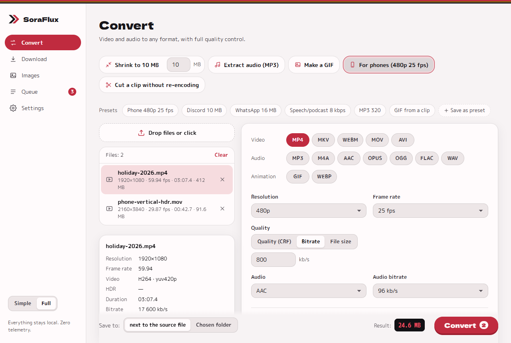 |  |
| **City Pop** · cybersora | 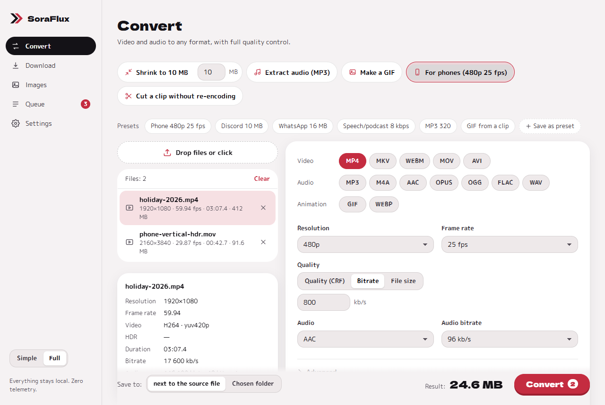 | 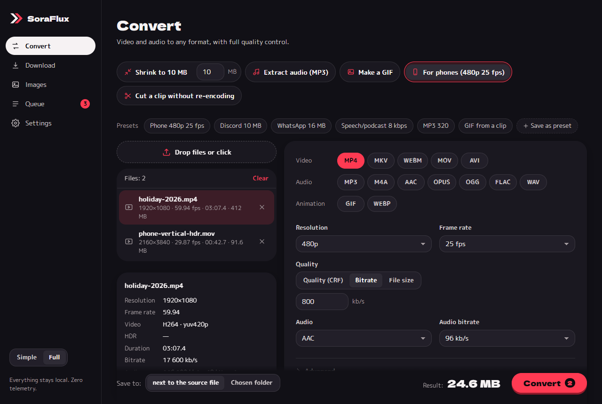 |
| **MiniDisc** · cybersora | 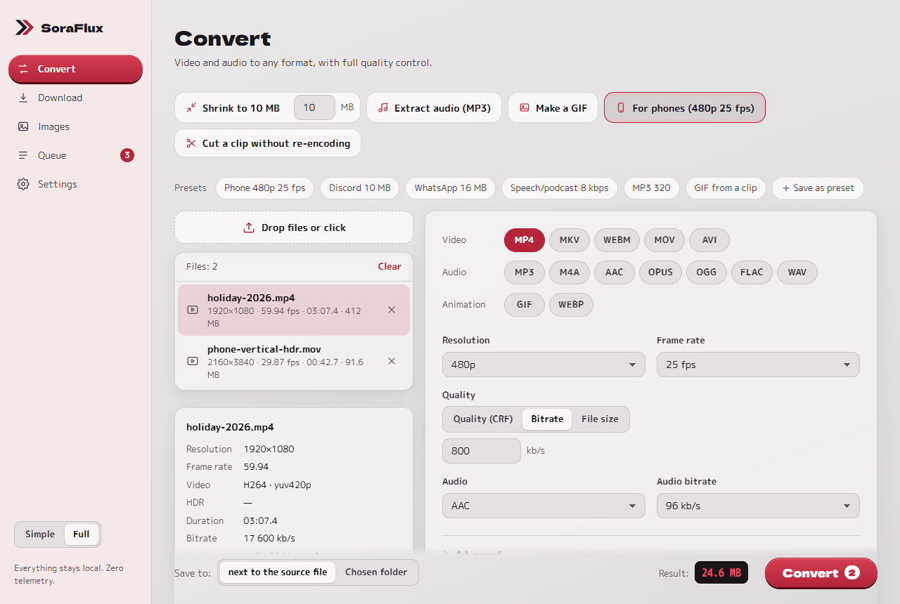 |  |
| **Kissaten** · Japanese | 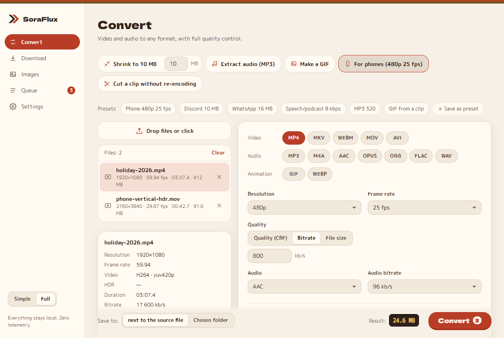 | 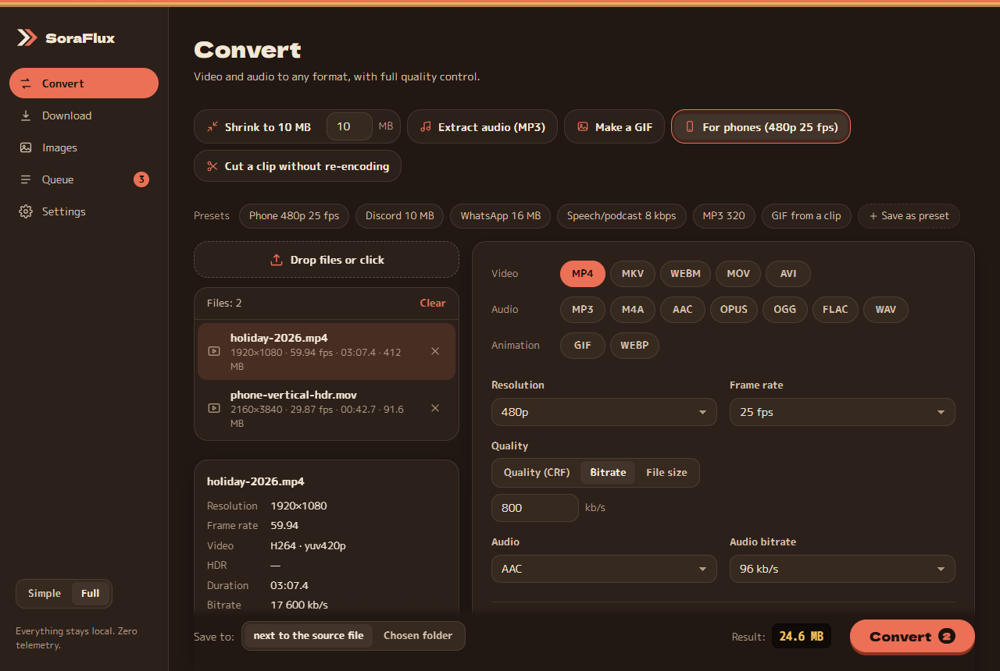 |
| **City Pop** · Japanese |  | 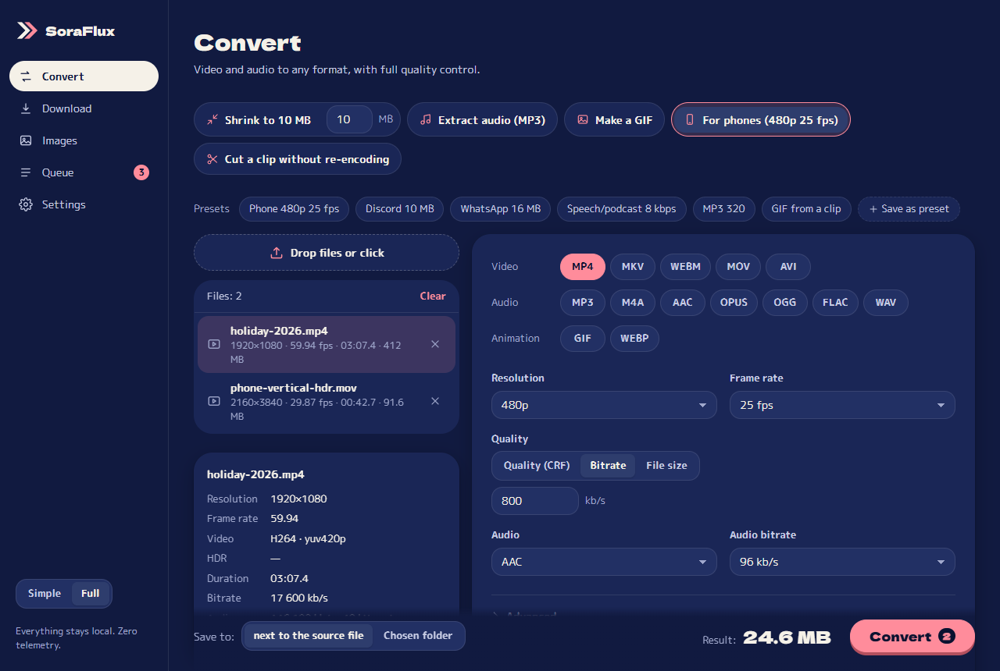 |
| **MiniDisc** · Japanese | 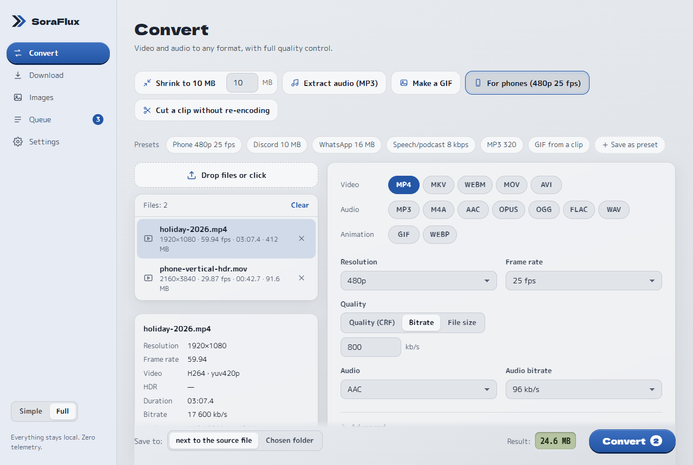 | 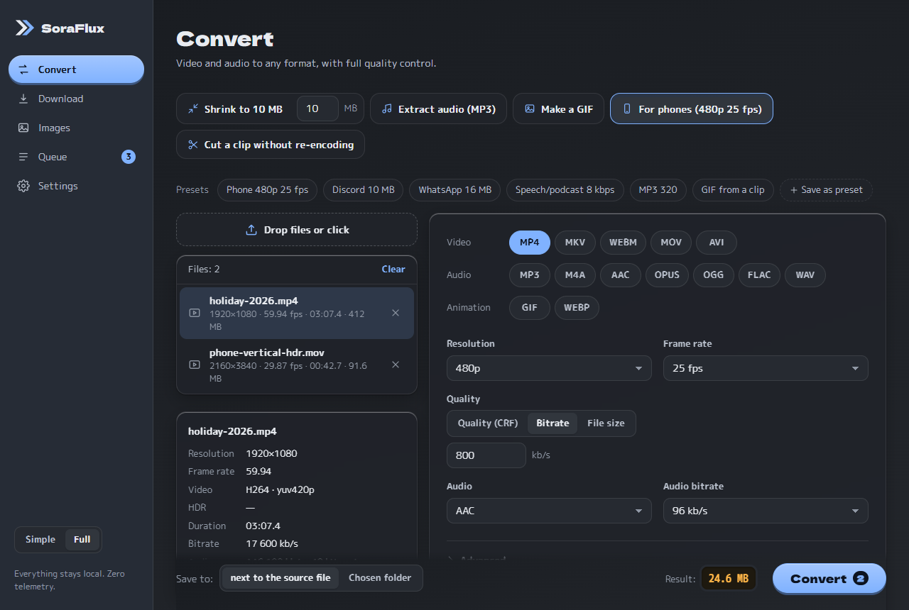 |

| | |
|---|---|
| 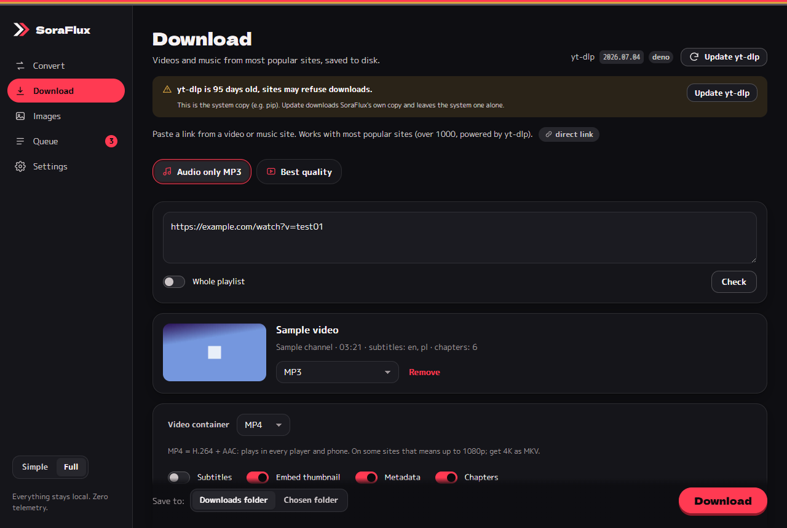 |  |
|  |  |

All screenshots are in [`zrzuty/en/`](zrzuty/en/) (English UI) and [`zrzuty/`](zrzuty/) (Polish UI), generated from a mock backend with made-up data (`npm run zrzuty:en`).

## Installation

SoraFlux is a normal Windows program with an installer. You don't need to know anything about GitHub or code.

1. Open the **[latest release](https://github.com/cybersora9/soraflux/releases/latest)** (or on the repository page, click **Releases** in the right-hand column).
2. Scroll down to **Assets** and click **`SoraFlux_x.y.z_x64-setup.exe`** (x.y.z is the version, e.g. 1.3.0). The browser saves it to your **Downloads** folder.
   Don't download "Source code (zip)" or "Source code (tar.gz)": that's the program's code, not the app.
3. Open the **Downloads** folder (or click the file in your browser's download list) and **double-click** `SoraFlux_…_x64-setup.exe`.
4. Windows may show a blue window **"Windows protected your PC"**. This is because the installer isn't code-signed yet (signing is in progress, [docs/SIGNING.md](docs/SIGNING.md)). Click **More info**, then **Run anyway**.
5. Choose the installer language and click **Next** / **Install**. No administrator rights are needed: it installs for your Windows user only.
6. Start **SoraFlux** from the Start menu (or the desktop shortcut, if you ticked it at the end of the installation).
7. On first run the **Welcome to SoraFlux** window checks for ffmpeg (and yt-dlp for downloads). Click **Get missing tools**: they come from their official releases, with SHA256 verification. Done.

You can also right-click a video, audio or image file in Explorer and pick **Convert with SoraFlux**.

- **Requirements:** Windows 10 or 11, 64-bit. The installer is small because ffmpeg and yt-dlp are not inside: the app downloads them from their official releases on first start (one click, SHA256 verified).
- **Portable mode:** create a folder named `portable` next to `SoraFlux.exe` (e.g. on a USB stick). Settings, presets, the log and the downloaded tools then live in that folder, nothing in your user profile.
- **Updating:** from 1.3.0 on, Settings → "Check for updates" downloads and installs a new version (signed, verified by the app). From 1.2.x, install 1.3.0 once by hand: download the new installer and run it over the old version; settings and presets are kept.
- **Uninstalling:** Windows Settings → Apps → Installed apps → SoraFlux → Uninstall.
- **Checking the file (optional):** each release has `SHA256SUMS.txt`. In PowerShell run `Get-FileHash $HOME\Downloads\SoraFlux_1.3.0_x64-setup.exe` and compare the result with the number in that file.

## How to use

1. **First run**: the wizard checks for ffmpeg and ffprobe. Download what's missing with one click (Windows: the officially recommended gyan.dev build, SHA256 verified) or pick the files yourself.
2. **Convert**: drop files or a folder (or click the drop zone, press Ctrl+O, or use "Convert with SoraFlux" in Explorer). Click a quick action or choose format, resolution, frame rate and quality; everything else is under "Advanced". Click a file in the list to see its info card; "Before / after preview" shows the result before you start.
3. **Download**: paste a link (or several), "Check", pick a quality or a quick action, "Download". Only download what you have the rights to; SoraFlux does not circumvent DRM.
4. **Images**: drop images, choose a format and size (W×H or %), quality.
5. **Queue**: progress, ETA, cancel, "Show in folder", size comparison.

Output goes next to the source (or to a folder you choose) and **never overwrites the original**: a name clash produces `name (1).mp4`. While working the file is called `name.part.mp4` and gets its final name only on success; partial files from a crash are cleaned up on the next start.

## FAQ

**Is it really free? What's the catch?**
No catch: MIT license, no ads, no account, no paid tier. It's made by [cybersora](https://cybersora.pl), a small studio that builds apps and websites to order; SoraFlux shows what we do.

**Do my files go anywhere?**
No. Converting happens on your computer with ffmpeg. The app only goes online when you ask: downloading tools, downloading from a link, checking for updates.

**Why does Windows say "Windows protected your PC"?**
The installer isn't code-signed yet (signing through SignPath is in progress). Click "More info" → "Run anyway", and if you want, compare the SHA256 with `SHA256SUMS.txt` from the release.

**Which sites can I download from?**
Most popular video and music sites (over 1000, through yt-dlp) and direct links to files. Only download what you have the rights to; SoraFlux does not circumvent DRM.

**Why is "Best quality" in MP4 only 1080p on some sites?**
MP4 means H.264 + AAC, which plays everywhere (phones, TVs, WhatsApp). Some sites only offer 4K in VP9 or AV1. For 4K, choose MKV as the container.

**Mac or Linux?**
The code builds on Linux (CI tests run there), but releases are Windows-only for now.

## Common problems

| Problem | What to do |
|---|---|
| Download: "The site blocked the download" (403) | Click "Update yt-dlp" on the Download tab and try again. Sites change often and a yt-dlp older than ~30 days stops working. The app uses its own yt-dlp copy, not the one from pip. |
| "ffmpeg is missing" | Settings → Tools → "Download" (Windows) or `sudo apt install ffmpeg` / `brew install ffmpeg`, then "Detect again". You can also pick `ffmpeg.exe` manually. |
| Windows: "Windows protected your PC" | The installer isn't signed yet: "More info" → "Run anyway". Compare the SHA256 with `SHA256SUMS.txt` from the release. Signing: [docs/SIGNING.md](docs/SIGNING.md). |
| Washed-out colors after converting iPhone/Android videos | Those are HDR recordings. The app converts them to SDR when ffmpeg has the `zscale` filter (the gyan.dev build does). Without it you'll see a hint: download ffmpeg from Settings. |
| Video won't play on a phone / in WhatsApp | Use "For phones (480p 25 fps)" or MP4 + H.264 + AAC. Don't enable 10-bit and don't put Opus in MP4. |
| "Target size too small" | At this length the video gets < 50 kbps. Trim it, lower the resolution or raise the MB limit. |
| Output is bigger than the original | The source was already heavily compressed. Use bitrate or target MB instead of CRF, or a lower resolution. |
| A cut without re-encoding starts a bit early | That's how stream copy works: it starts on the nearest keyframe. For frame accuracy, use a normal conversion with trimming. |
| NVENC/QSV/AMF doesn't work | Only encoders that passed a test encode are shown; if one fails mid-job, the app finishes on the CPU (noted in the queue). Update your GPU driver. |
| The computer stutters while converting | Settings → Work: "Videos at once" = 1 and "Keep the computer responsive". |
| Reporting a bug | Settings → "Copy report" (versions, system, recent errors, without your folder paths) and paste it into a [bug report](https://github.com/cybersora9/soraflux/issues/new/choose). |

## Privacy

**Everything is local, zero telemetry.** Files never leave your computer and no statistics are sent. The app only goes online when you ask: downloading tools (ffmpeg, yt-dlp, Deno), downloading videos and their thumbnails, and "Check for updates" (GitHub Releases). Settings (including the theme), presets and the error log are files on this computer (or in the `portable` folder next to the program in portable mode).

## External tools

ffmpeg, ffprobe, yt-dlp and Deno are **not in the repository or the installer**. Search order: path set in Settings → the app's tools folder (`%APPDATA%\SoraConverter\narzedzia`, `portable\narzedzia` in portable mode, or `narzedzia\` next to the `.exe`) → `PATH`. Exception: a yt-dlp from `PATH` older than 30 days (typically pip) with no own copy → the app downloads its own copy and uses it. Links and checksums: [`src-tauri/src/narzedzia/zrodla.rs`](src-tauri/src/narzedzia/zrodla.rs). Licenses: [THIRD_PARTY.md](THIRD_PARTY.md).

`SoraConverter` in folder names and the app identifier `pl.cybersora.soraconverter` is the app's earlier name, kept on purpose: changing it would break existing settings and updates.

## Building

Requirements: [Rust](https://rustup.rs) (stable), Node.js 20+, on Windows: Visual Studio Build Tools (C++). On Linux: `libwebkit2gtk-4.1-dev libgtk-3-dev librsvg2-dev libayatana-appindicator3-dev libsoup-3.0-dev`.

```bash
npm install
npm run tauri dev                      # development
npm run tauri build -- --bundles nsis  # Windows installer (src-tauri/target/release/bundle/nsis/)
```

Releases and signing run in GitHub Actions: [`.github/workflows/release.yml`](.github/workflows/release.yml), [docs/SIGNING.md](docs/SIGNING.md), [docs/UPDATES.md](docs/UPDATES.md).
UI-only preview in a browser (with a mock backend): `npm run dev`, then `http://localhost:1420/?demo=1`.

## Tests (the gate)

```bash
npm run bramka   # "bramka" = gate: fmt, clippy, cargo test, build, vitest, screenshots (one at a time)
```

- `cargo test`: the argument builder (table of cases), **integration tests with real ffmpeg** verified by ffprobe (480p/25 fps/AAC 8 kbps, 853×481, HDR PQ → SDR BT.709, VFR → 25 fps, rotation metadata, Opus 8 kbps, MP3 320, GIF 480 px 15 fps, WebP 50%), the queue (parallel jobs, 2 × 2-pass at once, cancel without leftover processes or `.part` files, `zażółć 日本 film.mp4` in a path > 260, hardware encoder fallback, video limit), preview and audio preview, the frontend↔Rust contract over Tauri IPC, downloads against a yt-dlp mock and made-up fixtures (no real copyrighted works in the repo), truncated files, GIF estimate calibration.
- `npm test`: vitest (logic, i18n PL/EN incl. every error key sent from Rust, the panel in jsdom, WCAG AA contrast, release config).
- `npm run zrzuty` / `npm run zrzuty:en`: Playwright screenshots with the mock backend → `zrzuty/` / `zrzuty/en/`.
- CI ([`.github/workflows/test.yml`](.github/workflows/test.yml), Linux + Windows) on every push and pull request.

## Architecture

The frontend (Vite + TypeScript, no framework) only draws and collects settings; Rust builds ffmpeg arguments with pure functions, runs ffmpeg/ffprobe, parses progress and reports it through events. Details: [ARCHITECTURE.md](ARCHITECTURE.md), pitfalls and their tests: [HARDENING.md](HARDENING.md).

**Code language:** identifiers and code comments are in Polish. Translating them would be a huge diff with real risk of regressions and no benefit for users, so they stay; the [glossary in ARCHITECTURE.md](ARCHITECTURE.md) maps the common names. The UI is Polish and English, and so are the error messages coming from Rust (`rust.*` keys in `src/i18n`).

## Code signing policy

Free code signing provided by [SignPath.io](https://signpath.io), certificate by [SignPath Foundation](https://signpath.org) (application in progress; until then the installer is unsigned).

- **What is signed:** only release builds produced from this repository by the GitHub Actions workflow [`release.yml`](.github/workflows/release.yml). Nothing built on a developer machine is signed.
- **Authors (committers):** members of the [cybersora9](https://github.com/cybersora9) account.
- **Reviewers:** the maintainer reviews every pull request from outside contributors.
- **Approvers:** the maintainer ([cybersora9](https://github.com/cybersora9)) approves every signing request by hand.
- **Privacy:** this program will not transfer any information to other networked systems unless specifically requested by the user or the person installing or operating it (downloading ffmpeg/yt-dlp/Deno, downloading media, "Check for updates"). Details: [Privacy](#privacy), [docs/SIGNING.md](docs/SIGNING.md).

## Contributing and security

Pull requests and issues are welcome in English (or Polish): [CONTRIBUTING.md](CONTRIBUTING.md). Please report vulnerabilities privately: [SECURITY.md](SECURITY.md).

## License

MIT, see [LICENSE](LICENSE). External tools: [THIRD_PARTY.md](THIRD_PARTY.md).
