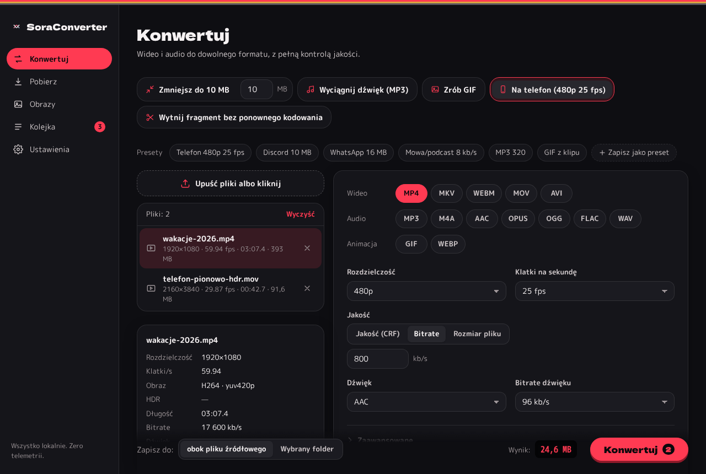
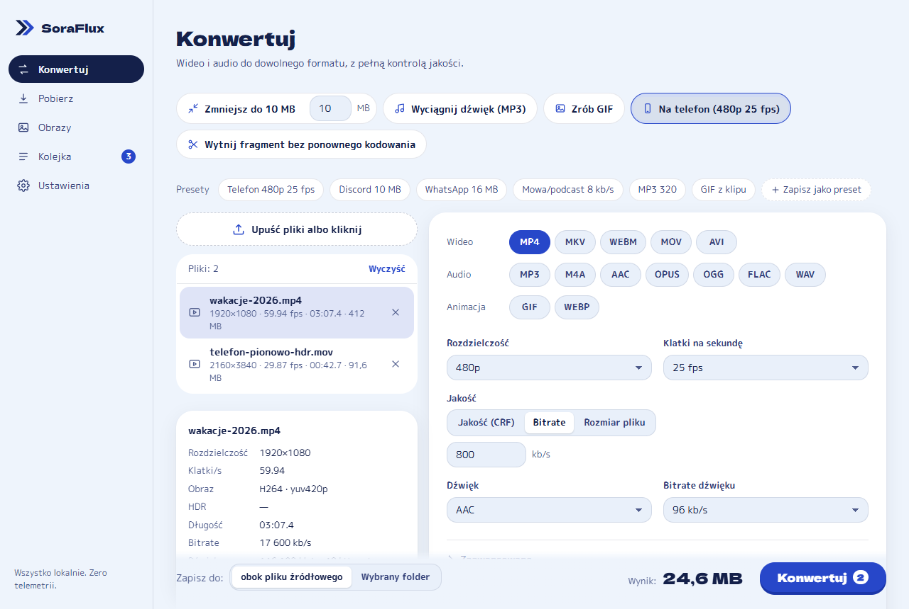
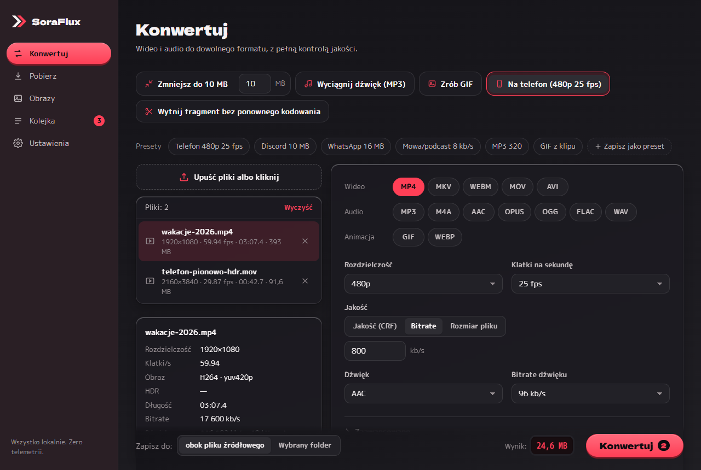
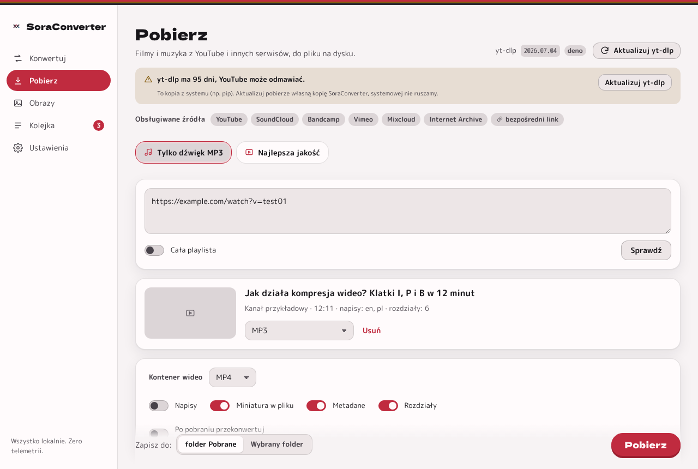
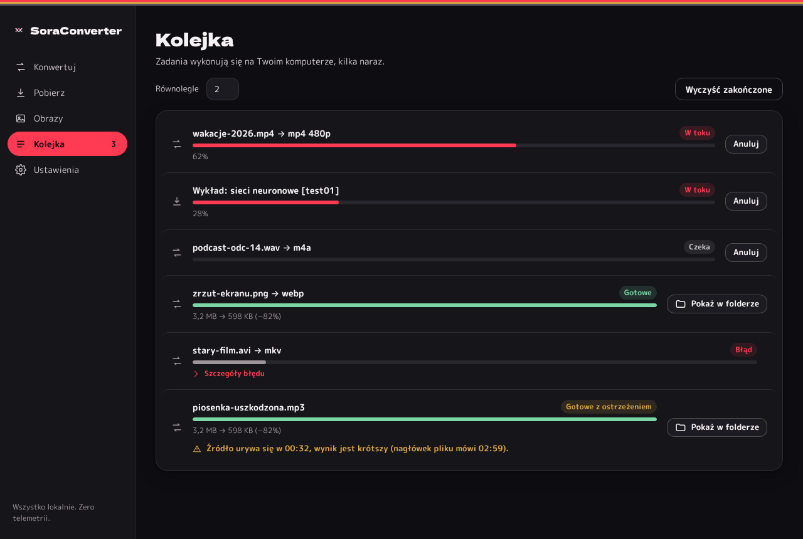
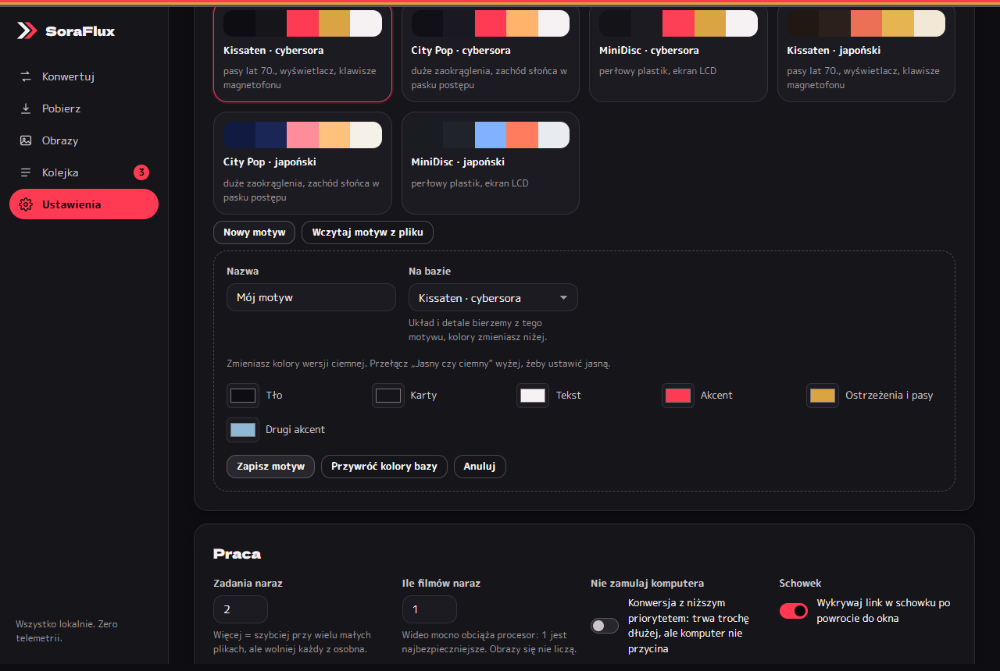
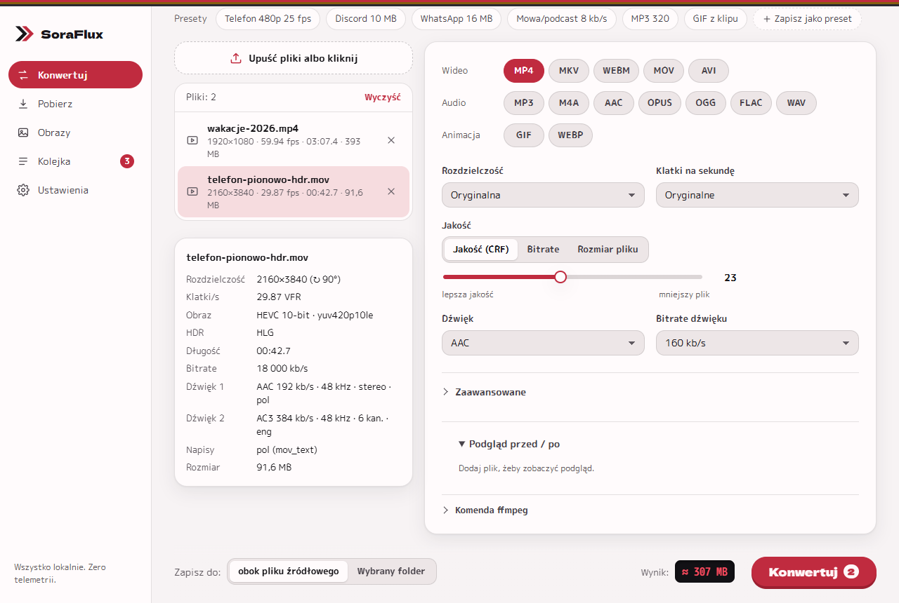
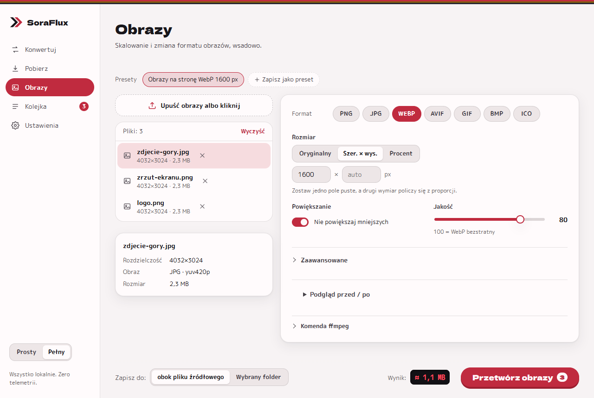
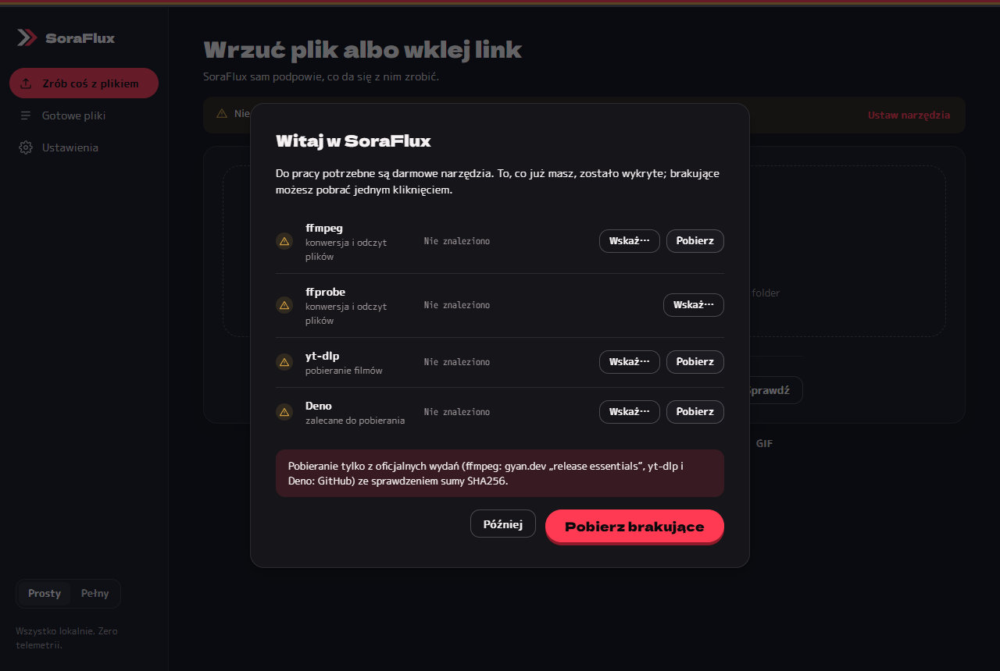

# SoraFlux

**Darmowy, otwarty, lokalny konwerter wideo, audio, obrazów i GIF-ów z pobieraniem (yt-dlp), z prostym GUI.**
Wszystko dzieje się na Twoim komputerze: żadnego uploadu, limitów, reklam ani telemetrii.

**Polski** · [English](README.md)

### [⬇ Pobierz SoraFlux na Windows](https://github.com/cybersora9/soraflux/releases/latest)
Za darmo, Windows 10/11 (64-bit). [Jak zainstalować, krok po kroku ↓](#instalacja)



## Co umie

- **Pobieranie** (yt-dlp): większość popularnych serwisów z wideo i muzyką oraz bezpośrednie linki; szybkie akcje „Tylko dźwięk MP3” i „Najlepsza jakość”, napisy, miniatura, metadane, rozdziały, playlisty, „po pobraniu przekonwertuj”. Apka pilnuje wieku yt-dlp: stary z systemu (np. z pipa) zastępuje własną, aktualną kopią, a przycisk „Aktualizuj yt-dlp” odświeża tylko tę kopię.
- **Motywy**: Kissaten, City Pop i MiniDisc w palecie cybersora albo japońskiej, każdy jasny i ciemny (kontrast WCAG AA), plus własne motywy z edytorem, eksportem i importem. Fonty wbudowane, działa offline.
- **Szybkie akcje jednym kliknięciem**: „Zmniejsz do X MB”, „Wyciągnij dźwięk (MP3)”, „Zrób GIF”, „Na telefon (480p 25 fps)”, „Wytnij fragment bez ponownego kodowania” (sekundy zamiast minut, bez straty jakości). Potem można wszystko dopracować w panelu.
- **Podgląd przed/po**: jedna klatka wyniku z dokładnie tymi ustawieniami, z wybranego suwakiem momentu, porównanie suwakiem dzielącym obraz. Przy dźwięku: odsłuch 5 s wyniku (np. jak naprawdę brzmi AAC 8 kb/s).
- **Pełna kontrola jakości wideo**: rozdzielczość (2160p…144p albo własne W×H), FPS (zachowaj, 60/50/30/25/24/15/10, własne), suwak CRF, bitrate w kb/s albo **docelowy rozmiar w MB** (2 przebiegi + automatyczna korekta, żeby plik naprawdę się zmieścił).
- **Dźwięk**: AAC, MP3, Opus, Vorbis, FLAC, WAV/PCM, kopiuj, bez dźwięku; **8–320 kb/s**, 8–96 kHz, mono/stereo, normalizacja głośności, wybór ścieżki (albo wszystkie), gdy plik ma kilka.
- **Dowolny kontener**: mp4, mkv, webm, mov, avi, gif, mp3, m4a, aac, opus, ogg, flac, wav. Niepasujące kodeki apka sama wyklucza; napisy przenosi tam, gdzie się da (MP4: mov_text, MKV: kopia, WebM: WebVTT).
- **GIF jak należy**: paleta w dwóch przebiegach, dithering do wyboru, FPS, szerokość, pętla, fragment, szacowany rozmiar z ostrzeżeniem. Animowany WebP jako lżejsza alternatywa.
- **Obrazy**: PNG, JPG, WebP, AVIF, GIF, BMP, ICO; W×H albo %, proporcje / rozciągnij / pasy / przytnij, nie powiększaj, jakość, wsadowo.
- **Foldery wsadowo**: upuść folder → wszystkie pasujące pliki, z zachowaniem struktury podfolderów, filtrem rozszerzeń i pomijaniem już przekonwertowanych.
- **Menu kontekstowe Eksploratora** „Konwertuj w SoraFlux”; kolejne pliki trafiają do już otwartego okna.
- **Karta informacji o pliku**: rozdzielczość, obrót, FPS (także zmienny), kodeki, bity, HDR, ścieżki dźwięku, napisy.
- **Po zakończeniu**: powiadomienie systemowe, „pokaż w folderze”, porównanie rozmiaru („412 MB → 74 MB (−82%)”).
- **Pancerz** na typowe pułapki: nieparzyste wymiary, 10 bitów i **HDR z telefonu** (automatyczna zamiana na SDR, żeby kolory nie wyblakły), zmienny FPS, obrót z metadanych, ścieżki z polskimi znakami i ponad 260 znaków, kilka zadań 2-pass naraz, enkoder sprzętowy, który pada (powrót do programowego), zamknięcie apki w trakcie (żadnego ffmpeg w tle). Szczegóły (po angielsku): [HARDENING.md](HARDENING.md), po polsku: [docs/pl/PANCERZ.md](docs/pl/PANCERZ.md).
- Kolejka (domyślnie 1 film naraz + obrazy obok, „Nie zamulaj komputera”, ostrzeżenie, gdy plik źródłowy jest ucięty), szacowany rozmiar na żywo, podgląd komendy ffmpeg, presety i własne presety, PL/EN, motyw ciemny i jasny (kontrast WCAG AA), obsługa klawiaturą, tryb przenośny.

## Zrzuty ekranu

| | |
|---|---|
|  |  |
|  |  |
|  |  |
|  |  |

Wszystkie zrzuty (6 motywów × jasny/ciemny i każda zakładka) są w [`zrzuty/`](zrzuty/).

## Instalacja

SoraFlux to zwykły program na Windows z instalatorem. Nie trzeba znać GitHuba ani programowania.

1. Otwórz **[najnowsze wydanie](https://github.com/cybersora9/soraflux/releases/latest)** (albo na stronie repozytorium kliknij **Releases** w prawej kolumnie).
2. Przewiń do sekcji **Assets** i kliknij **`SoraFlux_x.y.z_x64-setup.exe`** (x.y.z to wersja, np. 1.2.2). Przeglądarka zapisze plik w folderze **Pobrane**.
   Nie pobieraj „Source code (zip)” ani „Source code (tar.gz)”: to kod programu, a nie aplikacja.
3. Otwórz folder **Pobrane** (albo kliknij plik na liście pobranych w przeglądarce) i **kliknij dwa razy** `SoraFlux_…_x64-setup.exe`.
4. Windows może pokazać niebieskie okno **„System Windows ochronił ten komputer”**. To dlatego, że instalator nie jest jeszcze podpisany (podpis w trakcie, [docs/pl/PODPIS.md](docs/pl/PODPIS.md)). Kliknij **Więcej informacji**, potem **Uruchom mimo to**.
5. Wybierz język instalatora i kliknij **Dalej** / **Zainstaluj**. Uprawnienia administratora nie są potrzebne: program instaluje się tylko dla Twojego konta Windows.
6. Uruchom **SoraFlux** z menu Start (albo skrótem na pulpicie, jeśli zaznaczyłeś go na końcu instalacji).
7. Przy pierwszym uruchomieniu okno **Witaj w SoraFlux** sprawdzi ffmpeg (i yt-dlp do pobierania). Kliknij **Pobierz brakujące**: narzędzia przychodzą z oficjalnych wydań, z kontrolą sumy SHA256. Gotowe.

Możesz też kliknąć prawym przyciskiem plik wideo, audio albo obraz w Eksploratorze i wybrać **Konwertuj w SoraFlux**.

- **Aktualizacja:** pobierz nowy instalator tak samo i uruchom go na starej wersji; ustawienia i presety zostają.
- **Odinstalowanie:** Ustawienia Windows → Aplikacje → Zainstalowane aplikacje → SoraFlux → Odinstaluj.
- **Sprawdzenie pliku (opcjonalnie):** każde wydanie ma `SHA256SUMS.txt`. W PowerShellu wpisz `Get-FileHash $HOME\Downloads\SoraFlux_1.2.2_x64-setup.exe` i porównaj wynik z liczbą w tym pliku.

## Jak używać

1. **Pierwsze uruchomienie**: kreator sprawdza, czy masz ffmpeg i ffprobe. Brakujące pobierzesz przyciskiem (Windows: oficjalnie polecany build z gyan.dev, suma SHA256 sprawdzana) albo wskażesz ręcznie.
2. **Konwertuj**: upuść pliki albo folder (albo kliknij strefę, albo Ctrl+O, albo w Eksploratorze „Konwertuj w SoraFlux”). Kliknij szybką akcję albo wybierz format, rozdzielczość, FPS i jakość; resztę znajdziesz w „Zaawansowane”. Kliknij plik na liście, żeby zobaczyć jego kartę informacji; „Podgląd przed / po” pokaże wynik, zanim zaczniesz.
3. **Pobierz**: wklej link (albo kilka), „Sprawdź”, wybierz jakość albo szybką akcję, „Pobierz”. Pobieraj tylko to, do czego masz prawa; SoraFlux nie obchodzi DRM.
4. **Obrazy**: upuść obrazy, wybierz format i rozmiar (W×H albo %), jakość.
5. **Kolejka**: postęp, ETA, anulowanie, „Pokaż w folderze”, porównanie rozmiaru.

Wynik trafia obok źródła (albo do wybranego folderu) i **nigdy nie nadpisuje oryginału**: przy kolizji powstaje `nazwa (1).mp4`. W trakcie pracy plik nazywa się `nazwa.part.mp4`, docelową nazwę dostaje dopiero po sukcesie; niepełne pliki po awarii są sprzątane przy następnym starcie.

## Najczęstsze problemy

| Problem | Co zrobić |
|---|---|
| Pobieranie: „Serwis zablokował pobieranie” (403) | Kliknij „Aktualizuj yt-dlp” w zakładce Pobierz i spróbuj jeszcze raz. Serwisy często zmieniają strony, a yt-dlp starszy niż ~30 dni przestaje działać. Apka używa własnej kopii yt-dlp, nie tej z pipa. |
| „Brak ffmpeg” | Ustawienia → Narzędzia → „Pobierz” (Windows) albo `sudo apt install ffmpeg` / `brew install ffmpeg`, potem „Wykryj ponownie”. Możesz też wskazać `ffmpeg.exe` ręcznie. |
| Windows: „System Windows ochronił ten komputer” | Instalator nie jest jeszcze podpisany: „Więcej informacji” → „Uruchom mimo to”. Sumę SHA256 porównasz z `SHA256SUMS.txt` z wydania. Podpis: [docs/pl/PODPIS.md](docs/pl/PODPIS.md). |
| Kolory po konwersji z iPhone'a/Androida wyblakłe | To nagrania HDR. Apka sama zamienia je na SDR, jeśli ffmpeg ma filtr `zscale` (build z gyan.dev ma). Bez niego zobaczysz podpowiedź: pobierz ffmpeg z Ustawień. |
| Film nie gra na telefonie / w WhatsAppie | Użyj „Na telefon (480p 25 fps)” albo MP4 + H.264 + AAC. Nie włączaj 10 bitów i nie wybieraj Opus w MP4. |
| „Docelowy rozmiar za mały” | Przy tej długości filmu na obraz zostaje < 50 kb/s. Wytnij fragment, obniż rozdzielczość albo zwiększ limit MB. |
| Plik wyszedł większy niż oryginał | Źródło było już mocno skompresowane. Wybierz bitrate albo rozmiar MB zamiast CRF, albo niższą rozdzielczość. |
| Cięcie bez kodowania zaczyna się chwilę wcześniej | Tak działa kopia strumienia: start na najbliższej klatce kluczowej. Dla co do klatki użyj zwykłej konwersji z cięciem. |
| Enkoder NVENC/QSV/AMF nie działa | Apka pokazuje tylko enkodery, które przeszły próbę; jeśli padnie w trakcie, sama dokończy na procesorze (informacja w kolejce). Zaktualizuj sterownik karty. |
| Komputer przycina w trakcie | Ustawienia → Praca: „Ile filmów naraz” = 1 i „Nie zamulaj komputera”. |
| Coś nie działa i chcesz zgłosić błąd | Ustawienia → „Kopiuj raport” (wersje, system, ostatnie błędy, bez ścieżek Twoich folderów) i wklej go w zgłoszeniu. |

## Prywatność

**Wszystko lokalnie, zero telemetrii.** Pliki nie opuszczają komputera, apka nie wysyła żadnych statystyk. Łączy się z internetem tylko, gdy o to poprosisz: pobieranie narzędzi (ffmpeg, yt-dlp, Deno), pobieranie filmów i ich miniatur oraz „Sprawdź aktualizacje” (GitHub Releases). Ustawienia (także motyw), presety i dziennik błędów są w plikach na tym komputerze (albo w folderze `portable` obok programu w trybie przenośnym).

## Narzędzia zewnętrzne

ffmpeg, ffprobe, yt-dlp i Deno **nie są w repozytorium ani w instalatorze**. Kolejność wyszukiwania: ścieżka z Ustawień → katalog narzędzi apki (`%APPDATA%\SoraConverter\narzedzia`, w trybie przenośnym `portable\narzedzia`, albo `narzedzia\` obok `.exe`) → `PATH`. Wyjątek: yt-dlp z `PATH` starszy niż 30 dni (typowo z pipa) bez własnej kopii → apka pobiera własną kopię i jej używa. Linki i sumy: [`src-tauri/src/narzedzia/zrodla.rs`](src-tauri/src/narzedzia/zrodla.rs). Licencje: [THIRD_PARTY.md](THIRD_PARTY.md).

## Budowanie

Wymagania: [Rust](https://rustup.rs) (stabilny), Node.js 20+, na Windows: Visual Studio Build Tools (C++). Na Linuksie: `libwebkit2gtk-4.1-dev libgtk-3-dev librsvg2-dev libayatana-appindicator3-dev libsoup-3.0-dev`.

```bash
npm install
npm run tauri dev                    # tryb deweloperski
npm run tauri build -- --bundles nsis  # instalator Windows (src-tauri/target/release/bundle/nsis/)
```

Wydania i podpisy budują się w GitHub Actions: [`.github/workflows/release.yml`](.github/workflows/release.yml), [docs/pl/PODPIS.md](docs/pl/PODPIS.md), [docs/pl/AKTUALIZACJE.md](docs/pl/AKTUALIZACJE.md).
Podgląd samego interfejsu w przeglądarce (z atrapą backendu): `npm run dev`, potem `http://localhost:1420/?demo=1`.

## Testy (bramka)

```bash
npm run bramka   # fmt, clippy, cargo test, build, vitest, zrzuty (jeden przebieg naraz)
```

- `cargo test`: budowniczy argumentów (tabela przypadków), **integracja z prawdziwym ffmpeg** sprawdzana ffprobe (480p/25 fps/AAC 8 kb/s, 853×481, HDR PQ → SDR BT.709, VFR → 25 fps, obrót z metadanych, Opus 8 kb/s, MP3 320, GIF 480 px 15 fps, WebP 50%), kolejka (równoległość, 2 × 2-pass naraz, anulowanie bez procesów i `.part`, `zażółć 日本 film.mp4` w ścieżce > 260, powrót z enkodera sprzętowego, limit wideo), podgląd i odsłuch, kontrakt front↔Rust przez IPC Tauri, pobieranie na atrapie yt-dlp i zmyślonych fixtures (żadnych prawdziwych utworów w repo), ucięty plik, kalibracja szacunku GIF.
- `npm test`: vitest (logika, i18n PL/EN, panel w jsdom, kontrast WCAG AA, konfiguracja wydania).
- `npm run zrzuty`: Playwright z atrapą backendu → `zrzuty/v1_2-*.png`.
- CI (`.github/workflows/test.yml`, Linux + Windows) przy każdym pushu i PR.

## Architektura

Front (Vite + TypeScript, bez frameworka) tylko rysuje i zbiera ustawienia; Rust buduje argumenty ffmpeg czystymi funkcjami, uruchamia ffmpeg/ffprobe, parsuje postęp i raportuje go zdarzeniami. Szczegóły: [docs/pl/ARCHITEKTURA.md](docs/pl/ARCHITEKTURA.md) (po angielsku: [ARCHITECTURE.md](ARCHITECTURE.md)), pancerz: [docs/pl/PANCERZ.md](docs/pl/PANCERZ.md).

**Język kodu:** identyfikatory i komentarze są po polsku (tłumaczenie to ogromna zmiana bez zysku dla użytkownika); interfejs jest po polsku i angielsku, komunikaty błędów z Rusta też (klucze `rust.*` w `src/i18n`). Zasady współpracy: [CONTRIBUTING.md](CONTRIBUTING.md), zgłaszanie luk: [SECURITY.md](SECURITY.md).

## Licencja

MIT, zobacz [LICENSE](LICENSE). Narzędzia zewnętrzne: [THIRD_PARTY.md](THIRD_PARTY.md).
